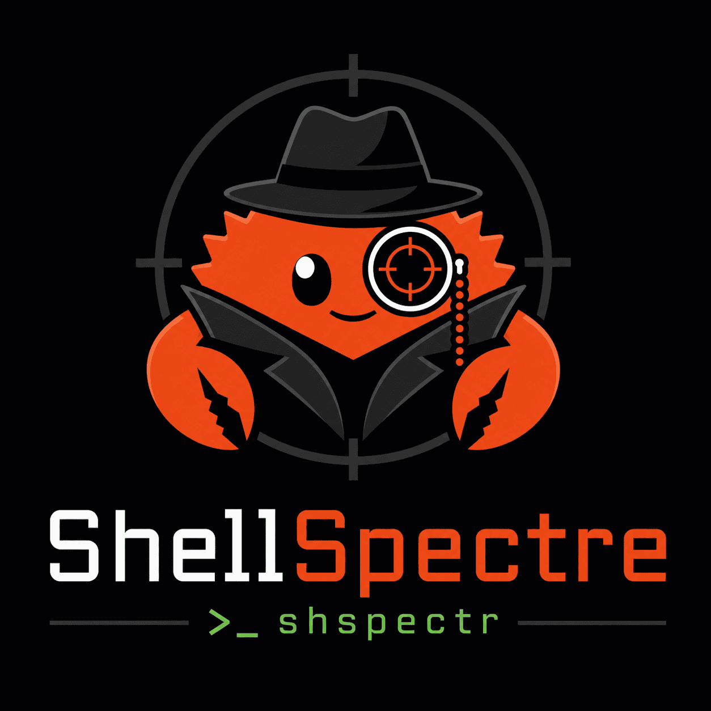

<p align="center">
  
</p>

# ShellSpectre

> [!NOTE]
> This project was built as part of a one-day solo hackathon for a Canonical engineering sprint.

Passive Linux session recorder built with Rust and eBPF. Captures command executions, I/O, and process lifecycle events at the syscall level. Records SSH sessions, local terminals, and agent-spawned processes without modifying monitored sessions.

The binary and crate names use the abbreviation `shspectr`.

## How It Works

ShellSpectre attaches eBPF tracepoints to seven syscalls (`execve`, `read`, `write`, `exit_group`) to observe what processes are running, what they read from stdin, and what they write to stdout/stderr. Events flow through a lock-free ring buffer into a userspace daemon that correlates them into sessions, applies optional filters, and writes everything to a SQLite database. A built-in web UI serves the recorded data over SSE for live tailing and historical browsing.

Nothing is injected into monitored processes. No shells are wrapped. No LD_PRELOAD. The recorder is invisible to the workloads it observes.

## Tech Stack

| Layer | Technology |
|---|---|
| eBPF framework | [aya-rs](https://aya-rs.dev/) — pure Rust, no libbpf or C dependency |
| Userspace | Rust (edition 2024), tokio, clap |
| Storage | SQLite in WAL mode (concurrent reads while recording) |
| OTel export | OTLP/HTTP via `opentelemetry-otlp` — logs format, no traces dependency |
| Web | axum + askama templates + [Datastar](https://data-star.dev/) (SSE-driven, no JS framework) |
| Styling | Tailwind CSS v4 |
| Build tooling | mise, mold linker, prek (pre-commit) |

## Architecture

```
Kernel (7 eBPF tracepoints)
  │  execve enter/exit, read enter/exit,
  │  write enter/exit, exit_group
  │
  ▼  RingBuf (lock-free)
Userspace daemon (shspectr)
  │  Event correlation → Session grouping → Filters
  │
  ├──▶ SQLite (WAL) ──▶ Web UI (shspectr-web)
  │                       axum + SSE → browser
  │
  └──▶ OTel (OTLP/HTTP) ──▶ Collector → Loki/Grafana
```

The project is split into four crates:

- **shspectr-common** — `#![no_std]` shared types (`#[repr(C)]` event structs) compiled for both BPF and userspace
- **shspectr-ebpf** — the eBPF programs (nightly Rust, `bpf-linker`)
- **shspectr** — the userspace CLI daemon that loads probes, consumes events, and writes to a configurable sink (SQLite or OTel)
- **shspectr-web** — read-only web UI with live tail, search DSL, and ANSI-rendered terminal output

BTF field offsets are resolved at runtime from the running kernel, so the eBPF programs are portable across kernel versions without recompilation.

## Features

- **Syscall-level capture** — command executions (filename + argv), stdin/stdout/stderr data (up to 4KB per event), process exits with error codes
- **Session correlation** — groups events by PTY, falls back to ancestor-based grouping, handles tmux/screen
- **BPF-side filtering** — self-exclusion, fd filtering (stdin/stdout/stderr + PTY devices), only captures I/O for processes seen via execve
- **Userspace filters** — `--filter-pty` for terminal sessions, `--filter-ancestor` for process trees (composable, OR logic)
- **Live tail** — SSE stream in the web UI prepends new events in real time
- **Search DSL** — `user:root comm:bash* !exit:0 pid:123` with keyword autocompletion
- **ANSI rendering** — terminal output displayed as coloured HTML in the web UI
- **Raw I/O export** — `GET /api/v1/events/{id}/raw?stream=stdout` returns plain text
- **JSON API** — `GET /api/v1/events` for scripted access
- **System tests** — end-to-end tests in LXD VMs via spread, loading real eBPF programs over SSH

## Quick Start

```sh
# Install system dependencies
sudo apt install clang mold pkg-config

# Install toolchain
mise install

# Build everything (eBPF + userspace)
mise run build

# Build and run with SQLite + web UI (requires root or CAP_BPF + CAP_PERFMON)
sudo mise run dev
# Open http://localhost:3000
```

## Web UI

```sh
# Browse recorded sessions standalone (reads SQLite DB at ./shspectr.db)
mise run dev-web
# Open http://localhost:3000
```

## Filtering

Composable filters narrow which processes are recorded. Pass extra args after `mise run dev --`:

```sh
# PTY sessions (SSH, local terminals, tmux/screen)
sudo mise run dev -- --filter-pty

# Descendants of specific processes
sudo mise run dev -- --filter-ancestor sshd,ansible

# Combine filters (OR logic)
sudo mise run dev -- --filter-pty --filter-ancestor my-agent

# Custom DB path
sudo mise run dev -- --db-path /var/lib/shspectr/shspectr.db
```

## OpenTelemetry Output

Instead of SQLite, events can be exported as OTLP logs over HTTP to any OpenTelemetry-compatible collector:

```sh
sudo mise run dev -- --output otel --otel-endpoint http://localhost:4318
```

Events are emitted as OTLP log records with `service.name=shspectr`. I/O data is base64-encoded and truncated to 4 KiB.

### OTel Demo Stack

The `otel-demo/` directory contains a Docker Compose stack (OTel Collector → Loki → Grafana) with a pre-built dashboard:

```sh
# Start the collector, Loki, and Grafana
cd otel-demo
docker compose up -d

# Run shspectr with OTel output (from the otel-demo directory)
sudo ./run-shspectr.sh

# Open Grafana at http://localhost:3001
# Query: {service_name="shspectr"}
```

Teardown: `docker compose down` from the `otel-demo/` directory.

## Development

```sh
mise run test          # Unit tests
mise run test-system   # End-to-end tests (requires LXD)
mise run fmt           # Format
mise run clippy        # Lint
prek run -av           # All pre-commit checks
```

## Documentation

See [docs/00-overview.md](docs/00-overview.md) for architecture, technology stack, code structure, and decision log.

## Requirements

- Linux kernel 5.8+ with BPF support
- Root or CAP_BPF + CAP_PERFMON capabilities
- Rust stable + nightly (managed by mise)
